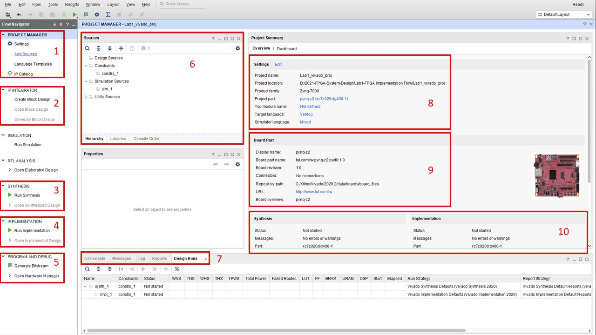

FPGA Design Lab1 - FPGA Implementation Flow
===================

# Part 1 - Introduction to Vivado Gui

### 1. Project Manager

#### 整個 Project 的管理包括了 : 檔案管理 , 專案設定 , IP資料夾路徑等等

### 2. IP Integrator

#### 以 Block Design 的方式來兜出整個系統，且可以加入 Xilinx 或是第三方所提供的 IP 來實作整個系統的設計

### 3. Synthesis

#### 將設計好的硬體描述檔合成成 FPGA 上由 CLB , Switch Box , Embedded Element 等元件所組成的實際電路

### 4. Implementation

#### 將合成好的實際電路擺放到 FPGA 上的確切位置 (Floor & Plan)

### 5. Program And Debug

#### Generate Bitstream : 將 Implementation 完的電路編譯成一個燒錄進 FPGA 的位元串流檔

### 6. Sources

#### 管理 `Design Sources` , `Constraints` , `Simulation Sources`

### 7.

#### - Tcl Console : 使用指令的方式來實作 Project (在 GUI 上每個點選的動作其實都有相對應的一條指令，也會顯示在這邊)

#### - Message : 任何系統訊息, warning, error都會顯示在這，若在實作 project 時卡關建議先到這裡找問題。

#### - Log : 紀錄 Project 歷程

#### - Reports : 回報 synthesis & implementation 如 timimg, power, utilization 等資訊。

#### - Design Runs : 顯示軟體現在正在進行什麼步驟。

### 8. Project Summary

### 9. 使用FPGA之資訊

### 10. Synthesis & Implementation 之 Summary

# Part 2 - Introduction to PYNQ-Z2

# Part 3 - FPGA Implementation Flow
